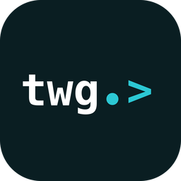

<p align="center">
  
</p>
<h1 align="center">Twigo</h1>
<p align="center"><b>A desktop IDE for NATS - work with your server the way Lens does for Kubernetes.</b></p>
<p align="center">
  <a href="https://github.com/twigo/twigo/releases/latest"></a>
  <a href="https://github.com/twigo/twigo/releases"></a>
  <a href="https://github.com/twigo/twigo/actions/workflows/ci.yml"></a>
  <a href="LICENSE"></a>
</p>

## Why

Existing NATS GUIs are functional but the experience is dated. Twigo aims to be
the tool you actually enjoy using: a fast, keyboard-first, well-designed client
that imports your existing `nats` CLI contexts and gets out of your way.

## Features

- Imports your existing `nats` CLI contexts (`~/.config/nats/context/`), with a
  configurable directory and an opt-in public demo server (`demo.nats.io`)
- Connect / disconnect with live status; creds, token, user/password, nkey, and
  TLS (CA, client certificate, handshake-first); read-only contexts
- Subject explorer with live message rates
- Live subscriptions, publish, and request/reply
- Message viewer (JSON / text / hex) with message-to-message diff
- JetStream: streams & consumers, plus a message browser
- KV store browser with revision history
- Object store browser
- Server monitoring overview (varz / connz / jsz)
- Command palette, native menu, light & dark themes

## Install

Grab the latest build from the
[Releases page](https://github.com/twigo/twigo/releases/latest):

| Platform | Download            | Notes                 |
| -------- | ------------------- | --------------------- |
| macOS    | `.dmg`              | Apple silicon + Intel |
| Linux    | `.AppImage`, `.deb` | currently unsigned    |
| Windows  | coming soon         | not packaged yet      |

## Building from source

Prerequisites: [Node.js](https://nodejs.org) + [pnpm](https://pnpm.io),
[Rust](https://rustup.rs), and (for a local server) [Docker](https://docker.com).

```bash
pnpm install
docker compose up -d   # local NATS with JetStream (:4222) + monitoring (:8222)
pnpm tauri dev         # run the app
pnpm tauri build       # produce a release bundle
```

To generate continuous fake traffic for testing the subject explorer:

```bash
docker compose --profile traffic up -d   # publishes to telemetry.*, orders.*, …
```

## Stack

[Tauri 2](https://tauri.app) · React + TypeScript · [async-nats](https://github.com/nats-io/nats.rs)
· Tailwind CSS + shadcn/ui

## Contributing

Contributions are welcome - see [CONTRIBUTING.md](CONTRIBUTING.md).

## License

[MIT](LICENSE) © Serhii Mazurok
