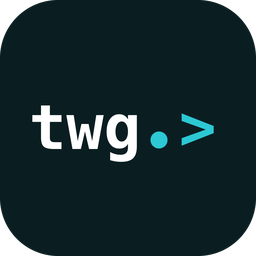

<p align="center">
  
</p>
<h1 align="center">Twigo</h1>
<p align="center"><b>A fast, keyboard-first desktop IDE for NATS.</b></p>
<p align="center">
  <a href="https://github.com/twigo/twigo/releases/latest"></a>
  <a href="https://github.com/twigo/twigo/releases"></a>
  <a href="https://github.com/twigo/twigo/actions/workflows/ci.yml"></a>
  <a href="LICENSE"></a>
</p>

## Why

NATS has excellent command-line tooling and a couple of serviceable GUIs. The
GUIs tend to be shaped like admin panels: a form per feature, a refresh button
where live data belongs, no memory of what you had open yesterday.

Twigo is shaped like an IDE. Tree on the left, tabs in the middle, inspector on
the right, and everything on the keyboard — `⇧⌘P` for the command palette, `⌘\`
to split, `?` for the rest. It reads the contexts your `nats` CLI already has,
so there is no second place to keep connection details in sync.

## What it does

**Connections.** Imports `~/.config/nats/context/` and writes the same format
back, so contexts round-trip with the CLI. Auth via creds file, token,
user/password or nkey; TLS with a CA and client certificate, including
handshake-first servers. Any context can be locked read-only — enforced in the
Rust layer, not by hiding buttons in the UI.

**Messaging.** The subject explorer builds a tree from live traffic and shows
per-subject rates, since core NATS has no subject registry to ask. Subscribe,
publish, request/reply. The viewer renders JSON, text and hex, and will diff any
two messages against each other. Sends land in a history you can replay from.

**JetStream.** Streams and consumers, with a message browser that walks
sequences through `get_raw_message` — it never creates a consumer and never
moves an ack floor, so browsing production is safe. Stream edits are
read-modify-write and land behind a diff you have to confirm. Consumer
pause/resume on servers 2.11 and newer.

**KV and Object Store.** Both read and write. KV keeps revision history and
updates through CAS, so a conflict comes back as a conflict rather than a
silent overwrite.

**Payload codecs.** Protobuf, MessagePack and CBOR, decoding _and_ encoding.
Point it at a `.proto` and it compiles in-app; map a subject pattern to a codec
and every viewer downstream decodes through it, while publishing encodes on the
way out. Replayed messages keep their exact bytes.

**Responders.** Answer a subject from a template to mock a service. The `{{ }}`
expressions run in a sandboxed QuickJS instance with the request in scope.

**Monitoring.** varz, connz and jsz over `$SYS`, or over the HTTP monitoring
port when the connection isn't a system account. Throughput, memory and consumer
lag are charted over time instead of sampled once.

Plus the workbench bits: command palette with recents, split panes, native menu,
per-technology space tabs, light and dark themes.

## Install

Grab the latest build from the
[Releases page](https://github.com/twigo/twigo/releases/latest):

| Platform | Download            | Notes                 |
| -------- | ------------------- | --------------------- |
| macOS    | `.dmg`              | Apple silicon + Intel |
| Linux    | `.AppImage`, `.deb` | currently unsigned    |
| Windows  | coming soon         | not packaged yet      |

## Building from source

Prerequisites: [Node.js](https://nodejs.org) + [pnpm](https://pnpm.io),
[Rust](https://rustup.rs), and (for a local server) [Docker](https://docker.com).

```bash
pnpm install
docker compose up -d   # local NATS with JetStream (:4222) + monitoring (:8222)
pnpm tauri dev         # run the app
```

Day-to-day development only needs `pnpm tauri dev`. A release bundle
(`pnpm tauri build`) also signs the auto-update artifacts, so it expects
`TAURI_SIGNING_PRIVATE_KEY` in the environment; CI sets that during a release.

For something to look at in the subject explorer, there is a traffic generator:

```bash
docker compose --profile traffic up -d   # publishes to telemetry.*, orders.*, …
```

## Stack

[Tauri 2](https://tauri.app) · React + TypeScript · [async-nats](https://github.com/nats-io/nats.rs)
· Tailwind CSS + shadcn/ui

## Contributing

Contributions are welcome - see [CONTRIBUTING.md](CONTRIBUTING.md). Maintainers:
[RELEASING.md](RELEASING.md) covers cutting a release.

## License

[MIT](LICENSE) © Serhii Mazurok
