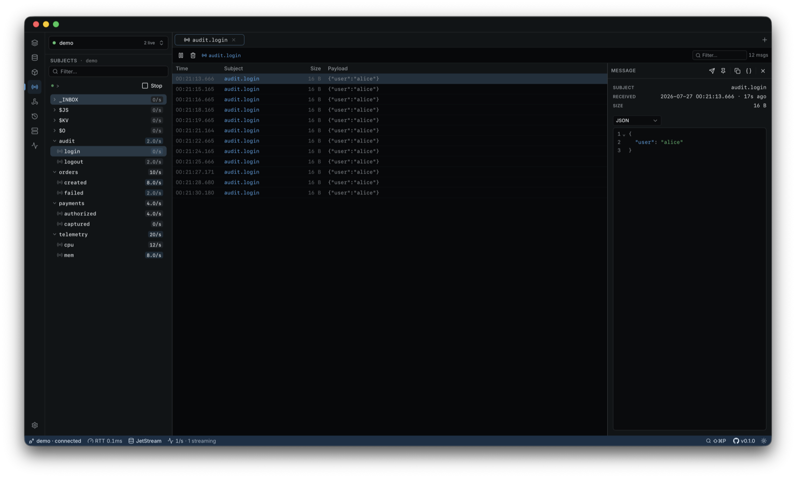
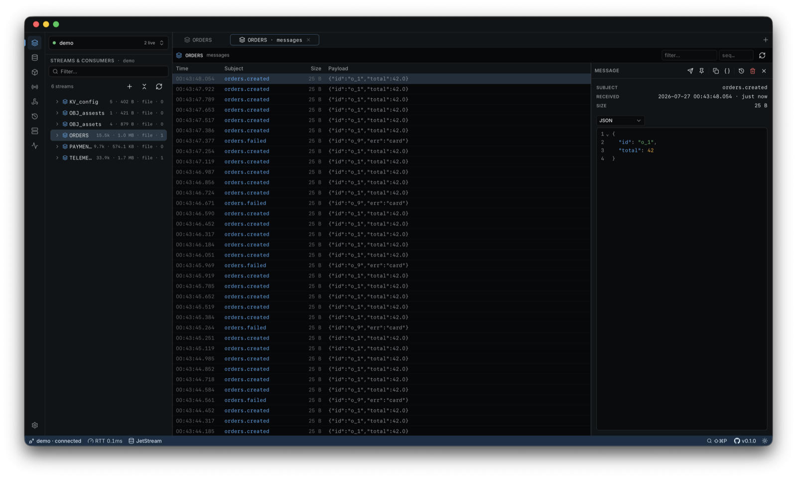
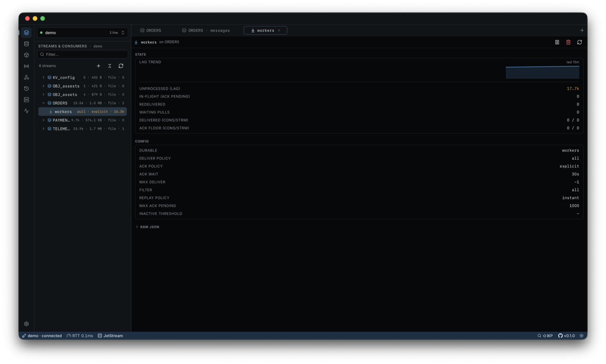
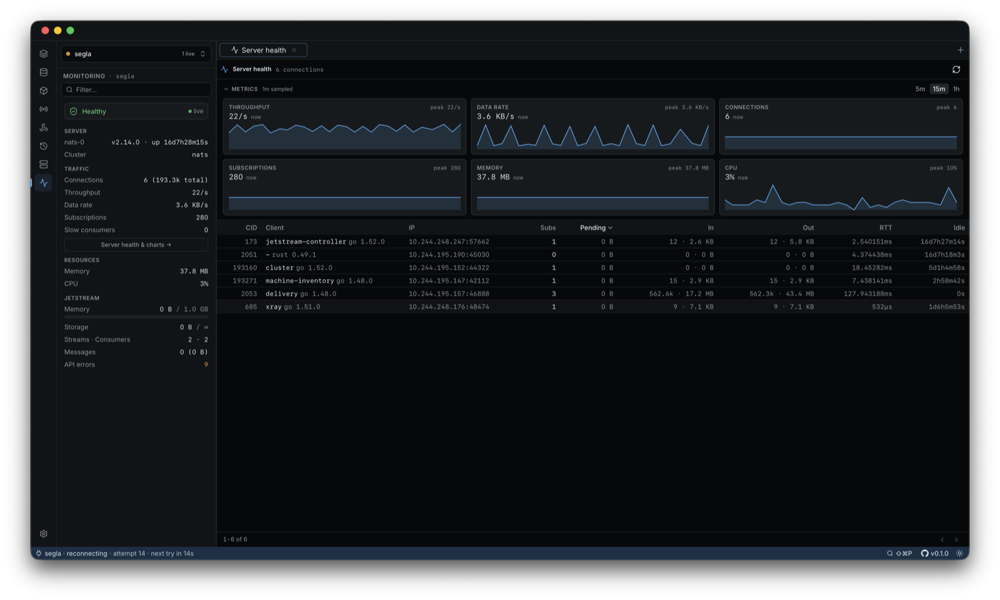

<p align="center">
  
</p>
<h1 align="center">Twigo</h1>
<p align="center"><b>A fast, keyboard-first desktop IDE for NATS.</b></p>
<p align="center">
  <a href="https://github.com/twigo/twigo/releases/latest"></a>
  <a href="https://github.com/twigo/twigo/releases"></a>
  <a href="https://github.com/twigo/twigo/actions/workflows/ci.yml"></a>
  <a href="LICENSE"></a>
</p>

<p align="center">
  
</p>

|                                                                   Browse a stream                                                                    |                                                      Consumer lag over time                                                       |                                                                                Server metrics                                                                                |
| :--------------------------------------------------------------------------------------------------------------------------------------------------: | :-------------------------------------------------------------------------------------------------------------------------------: | :--------------------------------------------------------------------------------------------------------------------------------------------------------------------------: |
|  |  |  |

## Why

NATS has excellent command-line tooling and a couple of serviceable GUIs. The
GUIs tend to be shaped like admin panels: a form per feature, a refresh button
where live data belongs, no memory of what you had open yesterday.

Twigo is shaped like an IDE. Tree on the left, tabs in the middle, inspector on
the right, and everything on the keyboard — `⇧⌘P` for the command palette, `⌘\`
to split, `?` for the rest. It reads the contexts your `nats` CLI already has,
so there is no second place to keep connection details in sync.

## What it does

**Connections.** Imports the contexts your `nats` CLI already has and writes them
back in the same format, so the two stay in sync. Creds files, tokens,
user/password, nkeys, TLS with a client certificate. Any context can be locked
read-only, and Twigo then refuses every write — a production connection can't be
fat-fingered.

**Messaging.** Subjects don't announce themselves in NATS, so the explorer
discovers them from live traffic and shows the rate on each. Subscribe, publish,
request/reply. Messages render as JSON, text or hex, and any two can be diffed
against each other. Everything you send is kept, ready to be sent again.

**JetStream.** Streams and consumers, with a message browser that is safe to
point at production: reading stored messages never creates a consumer and never
moves anyone's position in the stream. Editing a stream shows a diff of exactly
what will change before any of it is applied. Consumers can be paused and
resumed on servers 2.11 and newer.

**KV and Object Store.** Read and write both. KV keeps revision history, and a
value that changed under you comes back as a conflict instead of quietly
overwriting somebody else's work.

**Payload codecs.** Protobuf, MessagePack and CBOR, decoded _and_ encoded. Point
Twigo at a `.proto` file and map a subject to a message type: every message on
that subject is readable everywhere in the app, and publishing to it encodes on
the way out.

**Responders.** Mock a service by answering a subject from a template, with the
incoming request in scope — for when the thing you're integrating against
doesn't exist yet.

**Monitoring.** Server health from the system account, or from the HTTP
monitoring port when that isn't available. Throughput, memory and consumer lag
are charted over time, so you can see a trend rather than a single reading.

Plus the workbench around it: a command palette, split panes, a native menu,
per-technology tabs, and light and dark themes.

## Install

Grab the latest build from the
[Releases page](https://github.com/twigo/twigo/releases/latest):

| Platform | Download            | Notes                 |
| -------- | ------------------- | --------------------- |
| macOS    | `.dmg`              | Apple silicon + Intel |
| Linux    | `.AppImage`, `.deb` | currently unsigned    |
| Windows  | coming soon         | not packaged yet      |

## Building from source

Prerequisites: [Node.js](https://nodejs.org) + [pnpm](https://pnpm.io),
[Rust](https://rustup.rs), and (for a local server) [Docker](https://docker.com).

```bash
pnpm install
docker compose up -d   # local NATS with JetStream (:4222) + monitoring (:8222)
pnpm tauri dev         # run the app
```

Day-to-day development only needs `pnpm tauri dev`. A release bundle
(`pnpm tauri build`) also signs the auto-update artifacts, so it expects
`TAURI_SIGNING_PRIVATE_KEY` in the environment; CI sets that during a release.

For something to look at in the subject explorer, there is a traffic generator:

```bash
docker compose --profile traffic up -d   # publishes to telemetry.*, orders.*, …
```

## Stack

[Tauri 2](https://tauri.app) · React + TypeScript · [async-nats](https://github.com/nats-io/nats.rs)
· Tailwind CSS + shadcn/ui

## Contributing

Contributions are welcome - see [CONTRIBUTING.md](CONTRIBUTING.md). Maintainers:
[RELEASING.md](RELEASING.md) covers cutting a release.

## License

[MIT](LICENSE) © Serhii Mazurok
